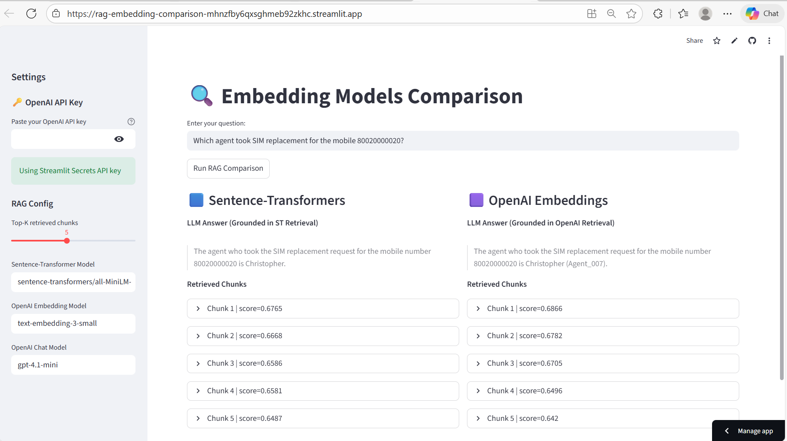

# 🔍 RAG Embedding Comparison: Sentence-Transformers vs OpenAI

This repository documents a practical experiment in **Retrieval-Augmented Generation (RAG)** aimed at understanding how different embedding models behave in real-world, numeric-heavy customer support scenarios.

---

## 🎯 Objective

The primary goal of this project was to investigate **how well different embedding models handle numeric identifiers (e.g., account numbers, broadband IDs, service IDs) in retrieval-based search.**

Specifically, we wanted to answer:

> *If a user asks a question containing a numeric identifier, can the retrieval system reliably find the correct record?*

Example test question:

> **“Which agent handled the customer with broadband 80020000008?”**

---

## 🛠️ What We Built

To study this, we built a **dual-index RAG system** with:

### 🔹 Data
- 100 synthetic customer support call center events  
- Each event represents a customer interaction with:
  - Event ID  
  - Event type  
  - Intent and sub-intent  
  - Timestamp  
  - Customer service transcript  
  - Numeric identifiers (e.g., broadband IDs, account numbers, service IDs)

Each **event/transcript is treated as a single semantic chunk**.

---

### 🔹 Two Parallel Retrieval Pipelines (FAISS)

We indexed the same dataset using two different embedding approaches:

| Index | Embedding Model | Vector Store |
|------|----------------|-------------|
| **Index 1** | `sentence-transformers/all-MiniLM-L6-v2` | FAISS |
| **Index 2** | `text-embedding-3-small` (OpenAI) | FAISS |

This allowed us to compare retrieval behavior **side-by-side on identical data**.

---

## 📱 Streamlit App (Interactive Comparison)

The Streamlit application allows users to:

- Enter **one question**
- Retrieve results from **both indexes simultaneously**
- Compare:
  - Retrieved chunks  
  - LLM-generated answers grounded in each retrieval  

---

## 📸 Results at a Glance (Three Key Cases)

### **Case 1 — Numeric Question: Sentence-Transformers Fails (Core Finding)**
> *“Which agent handled customer with broadband 80020000008?”*

**What we observed:**
- ❌ Sentence-Transformers: retrieved incorrect or loosely related chunks  
- ✅ OpenAI embeddings: retrieved the correct transcript and agent  

---

### **Case 2 — Numeric Question: Both Models Work (Edge Case)**
> *“Show me the transcript for service ID 90030000005”*

**What this shows:**
- Not all numeric queries break Sentence-Transformers  
- Some numeric patterns are still retrievable  
- The problem appears to depend on *how the number appears in context*

---

### **Case 3 — Textual Question: Both Models Work (Baseline)**
> *“Which agent handled a fraud complaint?”*

**What this confirms:**
- For purely textual queries, both embeddings perform similarly  
- The gap appears primarily when **long numeric identifiers are involved**

---

## 🔍 Key Observation (Core Finding)

When querying with certain **long numeric identifiers** (e.g., broadband IDs), we consistently saw:

### ✅ OpenAI Embeddings
- Successfully retrieved the correct transcript  
- Identified the correct agent  
- Generated an accurate, grounded answer  

### ❌ Sentence-Transformers
- Struggled to retrieve the correct record  
- Often retrieved semantically similar but numerically incorrect events  
- Resulted in incorrect or incomplete answers  

---

## 🤔 What This Suggests (Hypothesis)

While we did not conclusively prove the root cause, our observations suggest:

- **Sentence-Transformers embeddings may not preserve numeric specificity as effectively as OpenAI embeddings.**
- This could be due to:
  - Tokenization differences  
  - How numbers are represented in embedding space  
  - Training data biases  
  - Loss of precision for long numeric sequences  

This is an important consideration for RAG systems that rely heavily on **IDs, account numbers, transaction numbers, or service identifiers.**

---

## 📌 Why This Matters (Practical Implications)

For enterprise RAG systems dealing with:
- Customer support tickets  
- Banking records  
- Telecom accounts  
- Order management systems  
- Healthcare IDs  

👉 Choosing the **right embedding model can significantly impact retrieval accuracy**, especially when numeric identifiers are involved.

---

## 🚀 Live Demo

👉 **https://rag-embedding-comparison-mhnzfby6qxsghmeb92zkhc.streamlit.app/**

Try queries like:

- “Which agent handled customer with broadband 80020000008?”
- “Show me the transcript for service ID 90030000005”
- “Which agent handled a fraud complaint?”
